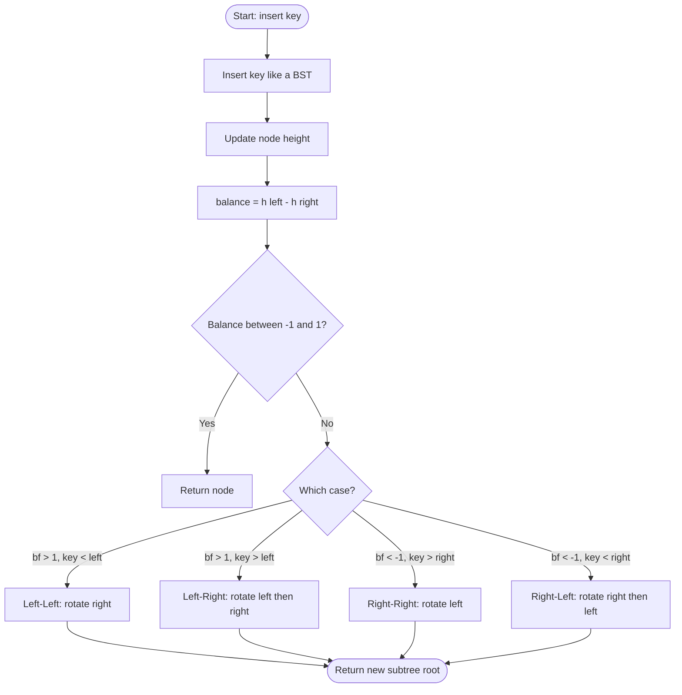

```mermaid
flowchart TD
    A([Start: insert key]) --> B[Insert key like a BST]
    B --> C[Update node height]
    C --> D[balance = h left - h right]
    D --> E{Balance between -1 and 1?}
    E -- Yes --> F[Return node]
    E -- No --> G{Which case?}
    G -- "bf > 1, key < left" --> H[Left-Left: rotate right]
    G -- "bf > 1, key > left" --> I[Left-Right: rotate left then right]
    G -- "bf < -1, key > right" --> J[Right-Right: rotate left]
    G -- "bf < -1, key < right" --> K[Right-Left: rotate right then left]
    H --> L([Return new subtree root])
    I --> L
    J --> L
    K --> L
```